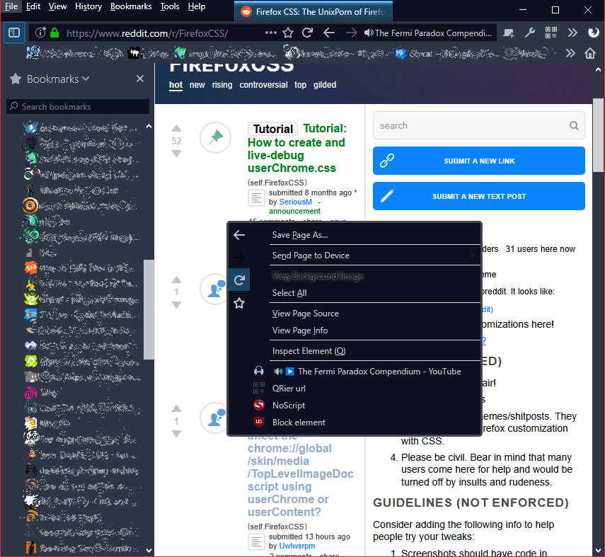

# But what is userChrome?

Simply put, it's a mechanism to modify the look of the user interface in Firefox. (I'll be using Firefox as example, but this same mechanism also applies to other Gecko Programs like Thunderbird.) When started, Firefox will try to load a special stylesheet **userChrome.css** from the current profile. If the file exists it will be applied to the Firefox UI, which historically is called *chrome* thus the name. This has no connection to Google Chrome, the naming existed long before Chrome was a thing.

The location of the file is as follows:

```
/<profile_Folder>
|__/extensions
|__/chrome
|  |_userChrome.css
|  |_userContent.css
|__prefs.js
|__...
|__<other_profile_files>
```

You may have heard of CSS (Cascading Style Sheet) files before, and think "hey isn't that whats being used to style web pages?" And indeed you would be correct. Firefox UI is essentially a document much like HTML, and the style of the layout is achieved with a whole lot of CSS. So, by loading userChrome you can inject additional style rules to that document.

# And what can I do with it?

Well, modify what the UI looks like. Simplest scenarios would be to hide unwanted things, such as certain menu items. Or perhaps edit UI colors, although themes might be better for that, unless you intend to change a lot of things.

But it can be much more than that, see:



Many of the things in the example are not achievable with extensions or themes.

* Context menu modifications
* Button modifications
* Menubar on same line as tabs when activated
* Bookmarks toolbar will only show when menubar is activated with Alt-key
* Scrollbar colors
* Navigation buttons "inside" of location bar
* Audible tab info in toolbar
* Tab close button is only and always shown when cursor is over that tab
* Modifying existing button images (main menu as Firefox logo)

Or you can have toolbars on bottom of the window. Multirow tabs or bookmarks (restrictions on functionality apply), extreme minimalism with everything on single row, different shape of tabs and whatnot.

<IMAGES HERE PERHAPS?>

Unfortunately, there is no simple way to get started, except by using existing styles. There are however certain issues with that too, most notably that some styles will not fully work together.

[Next chapter](userChrome_intro_2_aboutcss.md) will be a short intro to CSS in general. If you are already familiar with CSS syntax and usage rules you can skip over it to the [third chapter](userChrome_intro_3_xulcss.md) where we explore certain special cases about CSS used in chrome documents.

